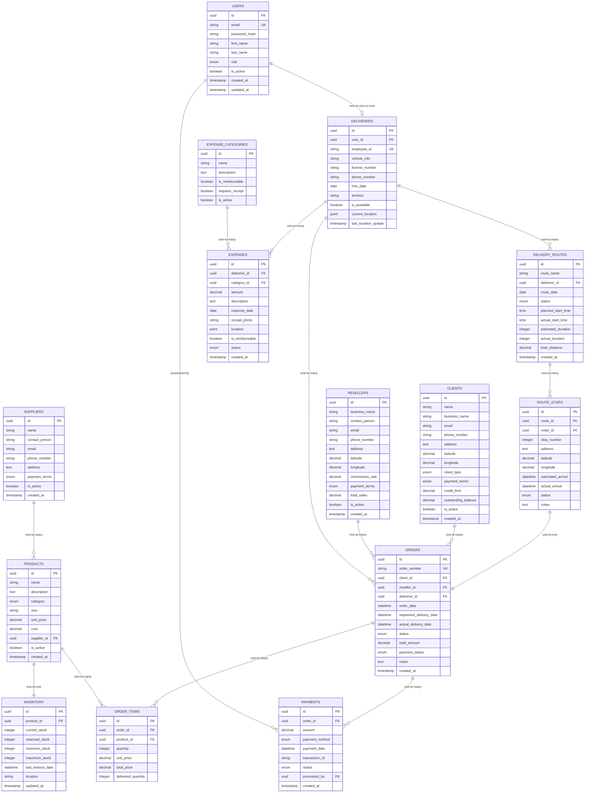

# UML Diagrams - Water Delivery Management System

## 1. Use Case Diagram


## 2. Enhanced Class Diagram (No Authentication)

```mermaid
classDiagram
    class Deliverer {
        +id: UUID
        +name: String
        +employeeId: String
        +vehicleInfo: String
        +licenseNumber: String
        +phoneNumber: String
        +hireDate: Date
        +territory: String
        +isAvailable: Boolean
        +currentLocation: Point
        +updateLocation()
        +markAvailable()
    }
    
    class Client {
        +id: UUID
        +name: String
        +businessName: String
        +email: String
        +phoneNumber: String
        +address: Address
        +clientType: ClientType
        +paymentTerms: PaymentTerms
        +creditLimit: Decimal
        +isActive: Boolean
        +outstandingBalance: Decimal
        +calculateBalance()
        +applyPayment()
    }
    
    class Reseller {
        +id: UUID
        +businessName: String
        +contactPerson: String
        +email: String
        +phoneNumber: String
        +address: Address
        +commissionRate: Decimal
        +paymentTerms: PaymentTerms
        +isActive: Boolean
        +totalSales: Decimal
        +calculateCommission()
    }
    
    class Product {
        +id: UUID
        +name: String
        +description: String
        +category: ProductCategory
        +size: String
        +unitPrice: Decimal
        +cost: Decimal
        +supplierId: UUID
        +isActive: Boolean
        +updatePrice()
        +calculateMargin()
    }
    
    class Inventory {
        +id: UUID
        +productId: UUID
        +currentStock: Integer
        +reservedStock: Integer
        +minimumStock: Integer
        +maximumStock: Integer
        +lastRestockDate: DateTime
        +location: String
        +addStock()
        +reserveStock()
        +releaseStock()
        +isLowStock()
    }
    
    class Order {
        +id: UUID
        +orderNumber: String
        +clientId: UUID
        +delivererId: UUID
        +orderDate: DateTime
        +requestedDeliveryDate: DateTime
        +actualDeliveryDate: DateTime
        +status: OrderStatus
        +totalAmount: Decimal
        +paymentStatus: PaymentStatus
        +notes: String
        +calculateTotal()
        +updateStatus()
    }
    
    class OrderItem {
        +id: UUID
        +orderId: UUID
        +productId: UUID
        +quantity: Integer
        +unitPrice: Decimal
        +totalPrice: Decimal
        +deliveredQuantity: Integer
        +calculateTotal()
    }
    
    class DeliveryRoute {
        +id: UUID
        +routeName: String
        +delivererId: UUID
        +routeDate: Date
        +status: RouteStatus
        +plannedStartTime: Time
        +actualStartTime: Time
        +estimatedDuration: Integer
        +actualDuration: Integer
        +totalDistance: Decimal
        +optimizeRoute()
        +calculateETA()
    }
    
    class RouteStop {
        +id: UUID
        +routeId: UUID
        +orderId: UUID
        +stopNumber: Integer
        +address: Address
        +estimatedArrival: DateTime
        +actualArrival: DateTime
        +status: StopStatus
        +notes: String
        +markCompleted()
    }
    
    class Payment {
        +id: UUID
        +orderId: UUID
        +amount: Decimal
        +paymentMethod: PaymentMethod
        +paymentDate: DateTime
        +transactionId: String
        +status: PaymentStatus
        +validatePayment()
    }
    
    class Expense {
        +id: UUID
        +delivererId: UUID
        +categoryId: UUID
        +amount: Decimal
        +description: String
        +expenseDate: Date
        +receiptPhoto: String
        +location: Point
        +isReimbursable: Boolean
        +status: ExpenseStatus
        +submitForApproval()
    }
    
    class ExpenseCategory {
        +id: UUID
        +name: String
        +description: String
        +isReimbursable: Boolean
        +requiresReceipt: Boolean
        +isActive: Boolean
    }
    
    class Supplier {
        +id: UUID
        +name: String
        +contactPerson: String
        +email: String
        +phoneNumber: String
        +address: Address
        +paymentTerms: PaymentTerms
        +isActive: Boolean
        +addProduct()
    }
    
    class Address {
        +street: String
        +city: String
        +state: String
        +zipCode: String
        +country: String
        +latitude: Decimal
        +longitude: Decimal
        +getCoordinates()
        +calculateDistance()
    }
    
    %% Relationships
    Deliverer ||--o{ DeliveryRoute : "assigned"
    DeliveryRoute ||--o{ RouteStop : "contains"
    RouteStop ||--|| Order : "delivers"
    
    Order ||--|| Client : "placed by"
    Order ||--o{ OrderItem : "contains"
    Order ||--o{ Payment : "paid through"
    OrderItem ||--|| Product : "for"
    
    Product ||--|| Supplier : "supplied by"
    Product ||--|| Inventory : "tracked in"
    
    Deliverer ||--o{ Expense : "incurs"
    ExpenseCategory ||--o{ Expense : "categorizes"
    
    Client ||--|| Address : "located at"
    Reseller ||--|| Address : "located at"
    Supplier ||--|| Address : "located at"
```

## 3. Sequence Diagram - Create Order and Assign Route


## 4. Activity Diagram - Mobile Delivery Process


## 5. Enhanced Entity Relationship Diagram



## 6. System Architecture Diagram


This comprehensive UML documentation covers all the enhanced requirements including inventory management, route planning, mobile support, and payment tracking. Would you like me to elaborate on any specific diagram or create additional ones?